# Physical_Verification_SKY130A

This repository contains the documantaion containg the work done during a 5 day workshop on physical verification carried out by VSD.

The workshop describes the physical verification process that takes place during an RTL to GDSII flow using Skywater 130nm Technology, including DRC and LVS tests. This helps the participants get ready for the tape out and is particularly helpful for chip fabrication. The workshop assists in locating and fixing violations made during the physical verification stage.

More information about the workshop can be found [here](https://www.vlsisystemdesign.com/physical-verification-using-sky130/)

A special thanks to Tim, Kunal and Sumanto for creating and helping out during this amazing workshop
- [R. Timothy Edwards](https://github.com/RTimothyEdwards)
- [Kunal Ghosh](https://github.com/kunalg123)
- [VSD-IAT](https://vsdiat.com/)

## Index
* [Chapter 0 - Getting the tools](#Chapter-0---Getting-the-tools)
* [Chapter 1 - Understanding the design flow](#Chapter-1---Understanding-the-design-flow)
* [Chapter 2 - DRC and LVS Fundamentals](#Chapter-2---DRC-and-LVS-Fundamentals)
* [Chapter 3 - DRC Issues](#Chapter-3---DRC-Issues)
* [Chapter 4 - LVS](#Chapter-4---LVS)
* [Additional Content - OpenLANE Design Flow](#Additional-Content---OpenLANE-Design-Flow)

## Chapter 0 - Getting the tools

To adequetly utilize the open source skywater130 pdk and understand the design flow we first require to install all the tools, which are
- open_pdk
- magic
- ngspice
- xschem
- netgen


*Note: open_pdk has to be installed last so it can correctly associate the xschem and magic directories.*
*Note:if the configure step fails during any process its most likely due to missing additional packages and they need to be installed (preferably from source) to complete the installation*

### Magic
Magic is an open source VLSI layout tool.<br /><br />
Install steps:
```
$  git clone git://opencircuitdesign.com/magic
$  cd magic
$	 ./configure
$  make
$  sudo make install
```
More info can be found at: [http://opencircuitdesign.com/magic/index.html](http://opencircuitdesign.com/magic/index.html)

### Netgen
Netgen is a tool for comparing netlists, a process known as LVS, which stands for "Layout vs. Schematic" <br /><br />
Install steps:
```
$  git clone git://opencircuitdesign.com/netgen
$  cd netgen
$	./configure
$  make
$  sudo make install
```
More info can be found at: [http://opencircuitdesign.com/netgen/index.html](http://opencircuitdesign.com/netgen/index.html)

### Xschem
Xschem is a schematic capture program <br /><br />
Install steps:
```
$  git clone https://github.com/StefanSchippers/xschem.git xschem_git
$	./configure
$  make
$  sudo make install
```
More info can be found at: [http://repo.hu/projects/xschem/index.html](http://repo.hu/projects/xschem/index.html)

### Ngspice
ngspice is the open source spice simulator for electric and electronic circuits.<br /><br />
Install steps:<br />

After downloading the tar ball from [https://sourceforge.net/projects/ngspice/files/](https://sourceforge.net/projects/ngspice/files/) to a local directory unpack it using:
```
 $ tar -zxvf ngspice-37.tar.gz
 $ cd ngspice-37
 $ mkdir release
 $ cd release
 $ ../configure  --with-x --with-readline=yes --disable-debug
 $ make
 $ sudo make install
```
More info can be found at: [https://ngspice.sourceforge.io/index.html](https://ngspice.sourceforge.io/index.html)

Please note that to view the simulation graphs of ngspice, xterm is required and can be installed using
```
$ sudo apt-get update
$ sudo apt-get install xterm
```

### open_pdk

Open_PDKs is distributed with files that support the Google/SkyWater sky130 open process description [https://github.com/google/skywater-pdk](https://github.com/google/skywater-pdk). Open_PDKs will set up an environment for using the SkyWater sky130 process with open-source EDA tools and tool flows such as magic, qflow, openlane, netgen, klayout, etc.<br /><br />
Install steps:
```
$  git clone git://opencircuitdesign.com/open_pdks
$  open_pdks
$	./configure --enable-sky130-pdk
$  make
$  sudo make install
```

Now that we have all the required tools installed lets get started with understanding the design flow!
## Chapter 1 - Understanding the design flow

### Verifiying the open_pdk installation
An initial working directory can be made by copying the required files as follows:
```
$ mkdir Lab1_and
$ cd Lab1_and
$ mkdir mag
$ mkdir netgen
$ mkdir xschem
$ cd xschem
$ cp /usr/local/share/pdk/sky130A/libs.tech/xschem/xschemrc
$ cp /usr/local/share/pdk/sky130A/libs.tech/ngspice/spinit .spiceinit
$ cd ../mag
$ cp /usr/local/share/pdk/sky130A/libs.tech/magic/sky130A.magicrc .magiccrc
$ cd ../netgen
```
Checking if magic works
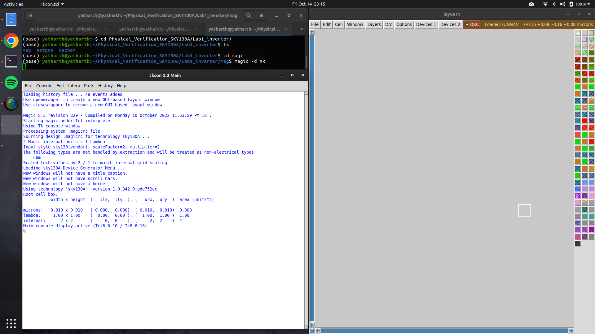<br />
Checking if xschem works
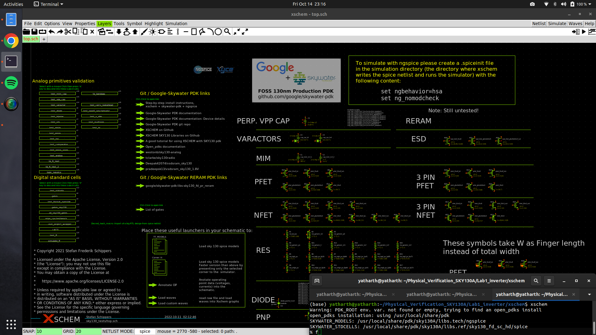<br />
Checking if netgen works
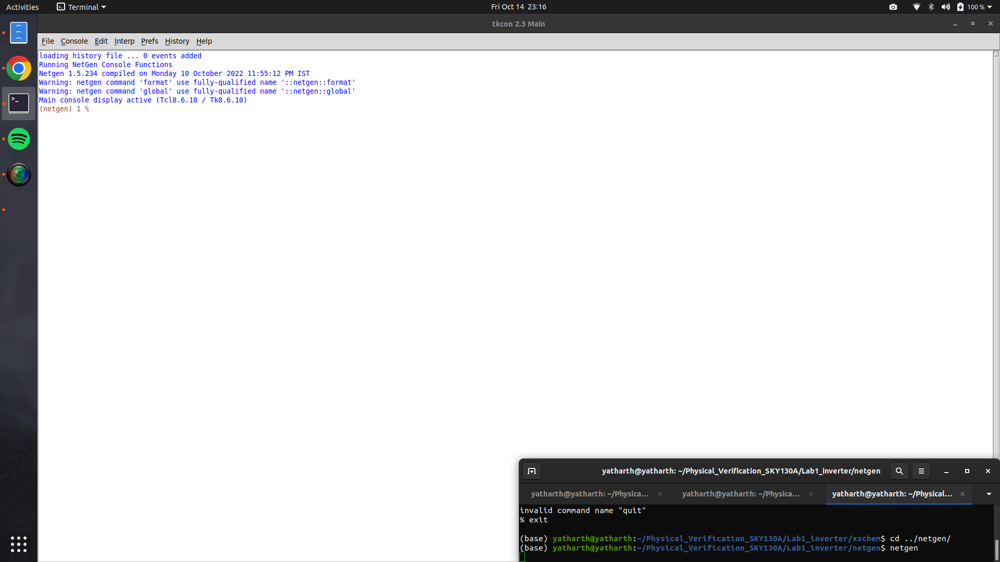<br />
Checking if ngspice works
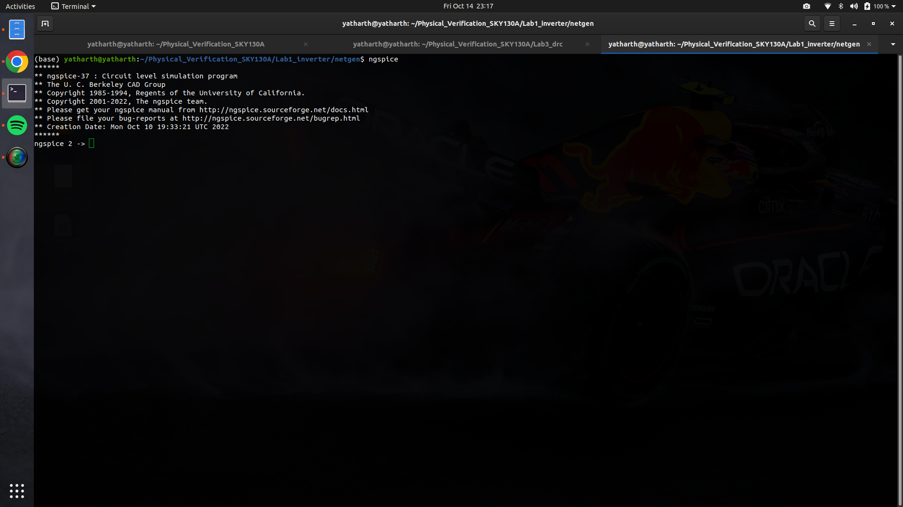<br />
### Creating inverter schematic using xschem
An initial schematic is made by placing components from the open_pdk library<br />
The required changes to the devices properties can be made here and will automatically reflect in the layout
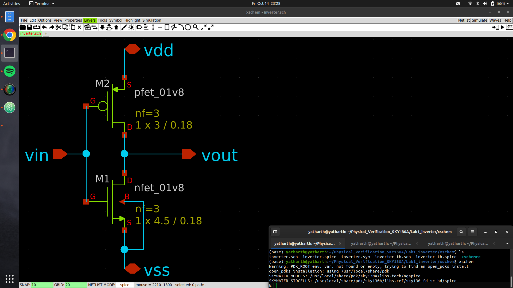<br />
Convert the schematic to a symbol
<br />
Using the symbol we can create an independent test bench to simulate the circuit
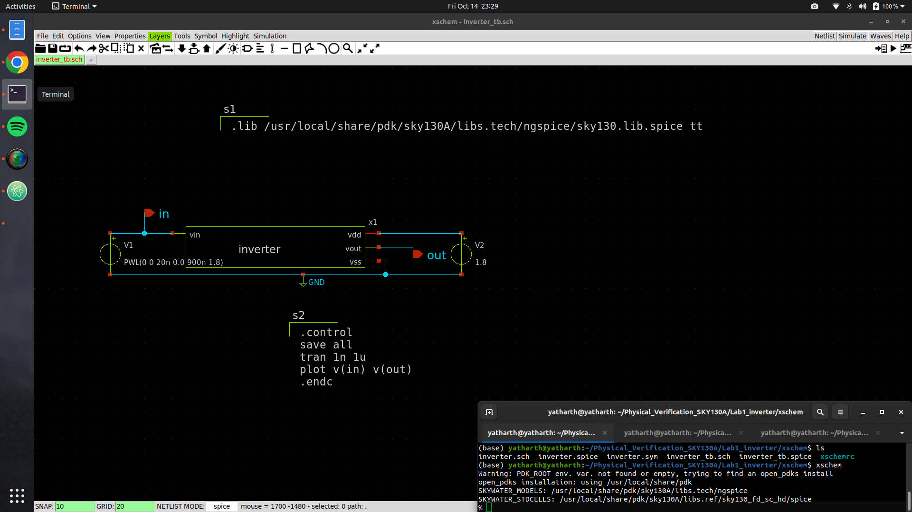<br />
### Creating and simulating testbench Schematic
The circuit can be simulated in ngspice. *make sure to disable .subckt in the simulation tab for the netlist generated for sim*
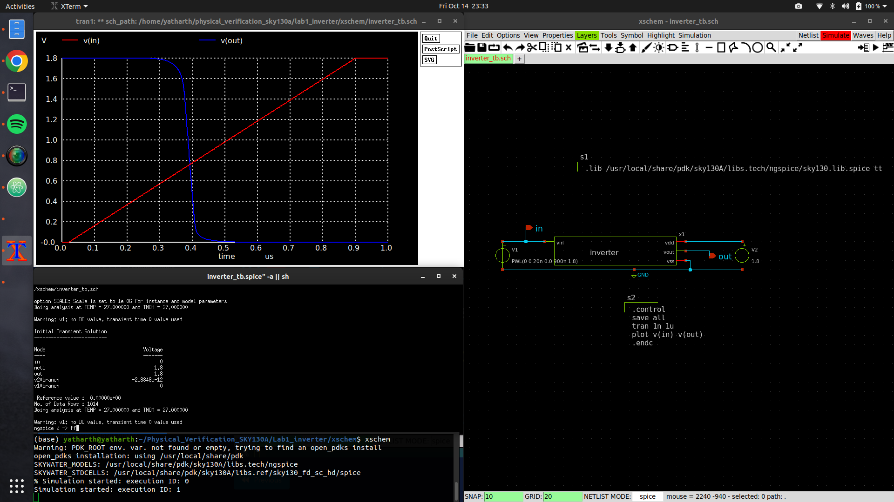
### Creating inverter layout in Magic and exporting its netlist
The original schematic can be used to export a netlist, which can be imported into magic to create the layout. <br /><br />

Set the appropiate device properties and route the layout.
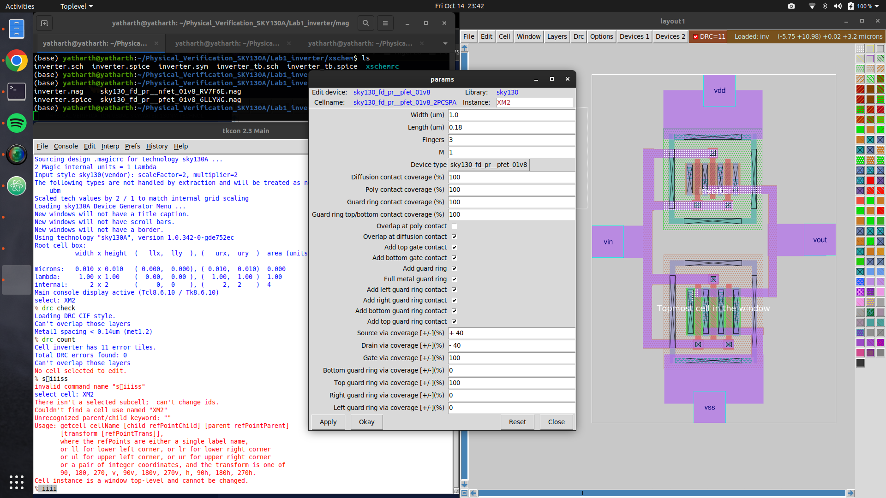<br /><br />
<br /><br />
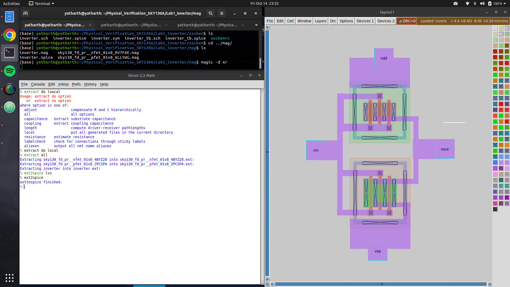<br /><br />
### Performing LVS checks on testbench and layout netlists
The netlist of the layout can be extracted using
```
% export do local
% export all
% ext2spice lvs
% ext2spice
```
The schematic netlist and layout netlist can be compared using LVS by netgen
```
$ netgen -batch lvs "../mag/inverter.spice inverter" "../xschem/inverter.spice inverter"
```
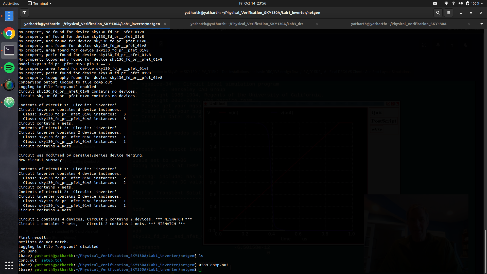
## Chapter 2 - DRC and LVS Fundamentals

### Design Rule Checking (DRC)
Make sure design layout meets all silicon foundry rules for masks.

### Layout vs. Schematic (LVS)
Make sure design layout matches a simulatable netlist by electrical connectivity and devices.


### Reading GDS files

```
$ cp /usr/local/share/pdk/sky130A/libs.tech/magic/sky130A.magicrc ./.magicrc
```

```
% gds read /usr/local/share/pdk/sky130A/libs.ref/sky130_fd_sc_hd/gds/sky130_fd_sc_hd.gds
% load sky130_fd_sc_hd__and2_1
```


```
% cif istyle sky130(vendor)
% gds read /usr/local/share/pdk/sky130A/libs.ref/sky130_fd_sc_hd/gds/sky130_fd_sc_hd.gds
```


### Matching ports to spice netlists

```
% port first
% port 1 name
% port 1 class
% port 1 use
```


```
% lef read /usr/local/share/pdk/sky130A/libs.ref/sky130_fd_sc_hd/lef/sky130_fd_sc_hd.lef
```


```
% readspice /usr/local/share/pdk/sky130A/libs.ref/sky130_fd_sc_hd/spice/sky130_fd_sc_hd.spice
% load sky130_fd_sc_hd__and2_1
```


### Abstract views

Note: difference between load and getcell

The difference is between a cell and an instance of that cell.
If you do load inverter, then you will be editing the cell called inverter.
If you do getcell inverter, then you will place an instance of the cell inverter inside the cell you're currently editing.

```
% lef read /usr/local/share/pdk/sky130A/libs.ref/sky130_fd_sc_hd/lef/sky130_fd_sc_hd.lef
% load sky130_fd_sc_hd__and2_1
% readspice /usr/local/share/pdk/sky130A/libs.ref/sky130_fd_sc_hd/spice/sky130_fd_sc_hd.spice
% load test
% getcell sky130_fd_sc_hd__and2_1
% gds write test     
```


Restart magic to and the cell fails to be loaded properly because the changes were not saved
```
%gds read test
%save test
```


When test is reloaded after saving we get the original layout
```
% load test
% gds write test
```
We can edit the cell by making it editable
```
% property
% cellname writeable sky130_fd_sc_hd__and2_1 true
% gds write test
```


and after restarting magic and reloading it we still get an unchanged cell
```
% gds read test
```


### Extraction
```
% extract all
% ext2spice lvs
% ext2spice
```

```
% ext2spice cthresh 0.01
% ext2spice
```


```
% ext2sim labels on
% ext2sim

% extresist tolerance 10
% extresist

% ext2spice lvs
% ext2spice cthresh 0.01
% ext2spice extresist on
% ext2spice
```


### DRC
```
$ /usr/local/share/pdk/sky130A/libs.tech/magic/run_standard_drc.py /usr/local/share/pdk sky130A/libs.ref/sky130_fd_sc_hd/mag/sky130_fd_sc_hd__and2_1.mag
```
```
% drc liastall style
% drc style drc(full)
% drc check
% drc why
% drc find
```
```
% getcell sky130_fd_sc_hd__tapvpwrvgnd_1
```
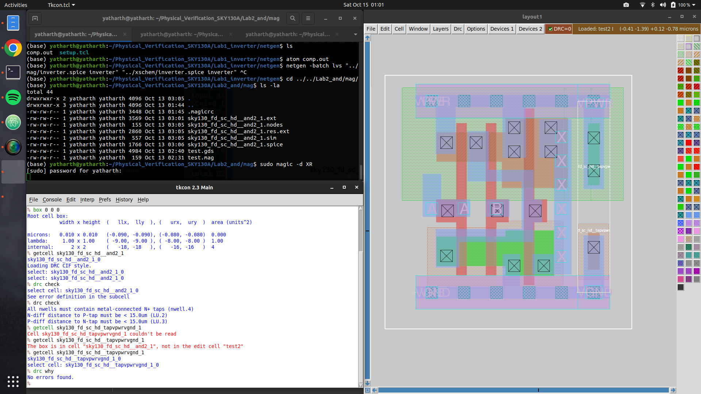

### LVS
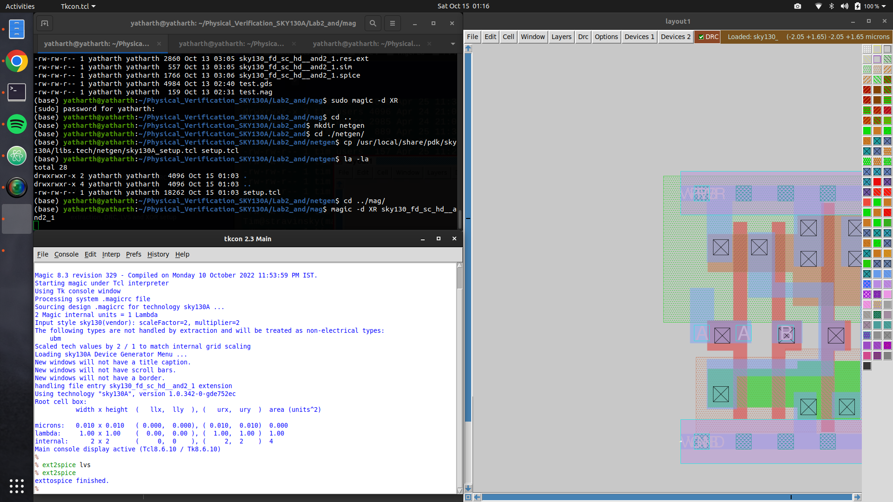

```
netgen -batch lvs "../mag/sky130_fd_sc_hd__and2_1.spice sky130_fd_sc_hd__and2_1" "/usr/local/share/pdk/sky130A/libs.ref/sky130_fd_sc_hd/spice/sky130_fd_sc_hd.spice sky130_fd_sc_hd__and2_1"
```
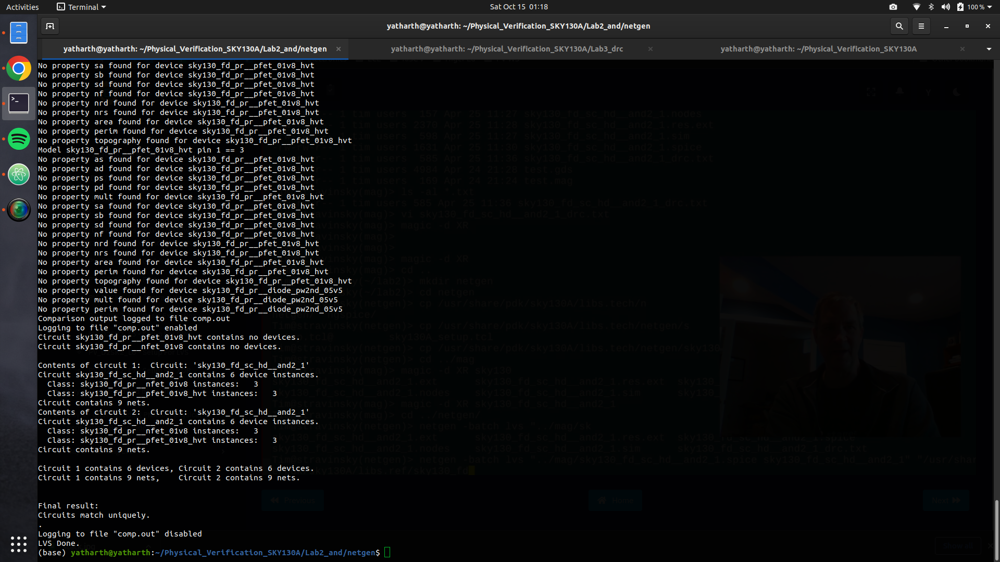

### XOR
XOR is the process to compare to GDS files by highlighting any differences between the two.
```
% flatten -nolabels xor_test
```
edit the cell
```
% xor -nolables xor_test
% load xor_test
```
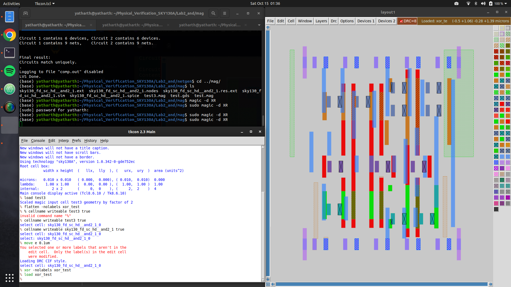

## Chapter 3 - DRC Issues

Each foundry has its own manufacturing rules and we have to make sure that the layout abides by these. The stackup for the skywater130 process is as folows:
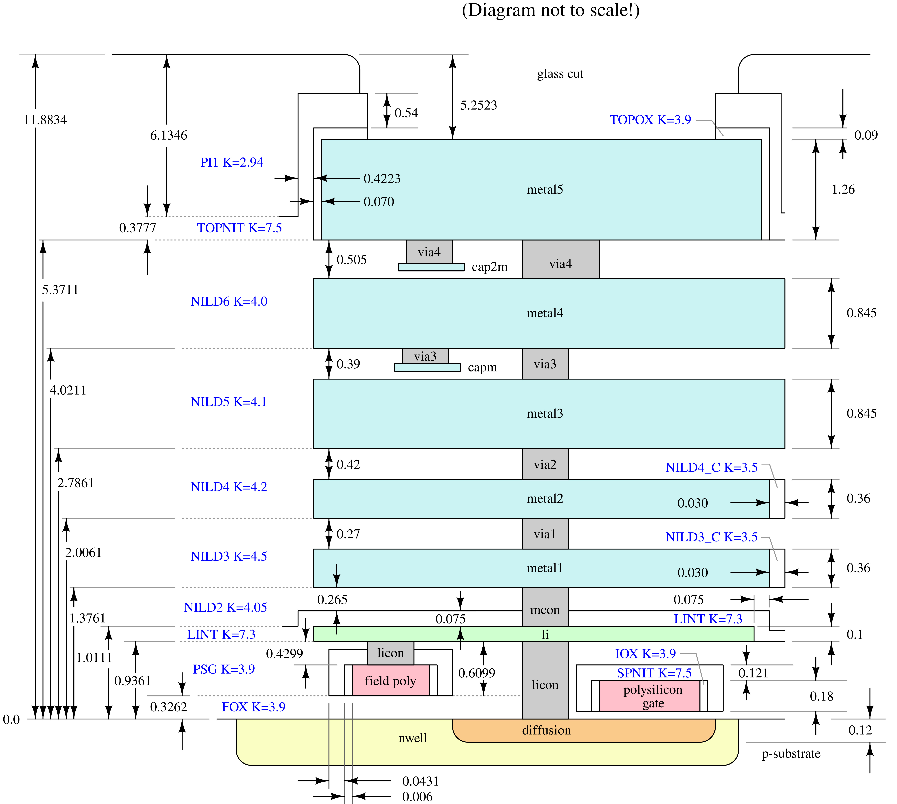

The detailed explaination of all the rules can be found as:
[https://skywater-pdk.readthedocs.io/en/main/rules.html](https://skywater-pdk.readthedocs.io/en/main/rules.html)

### Usefull Magic commands
- b
- s
- ?
- : box width 0.14um
- : stret u 0.14um
- : move e 0.14um
- : box grow c 0.01um
- : paint m1
- drc find
- see no *
- see m1

### Solving sample DRC voilations in Magic
#### width_rule

#### spaceing_rule

#### wide_spacing_rule

#### notch_rule

#### via_size

#### multiple_vias

#### via_overlap

#### auto_generate_via

#### minimum_area_rule

#### minimum_hole_rule

#### wells

#### deep_nwell

#### automatic_deep_nwell

#### derived_layers

#### derived_layer_high_voltage

#### derived_layers_automatic_layers

#### Paramterized Devices
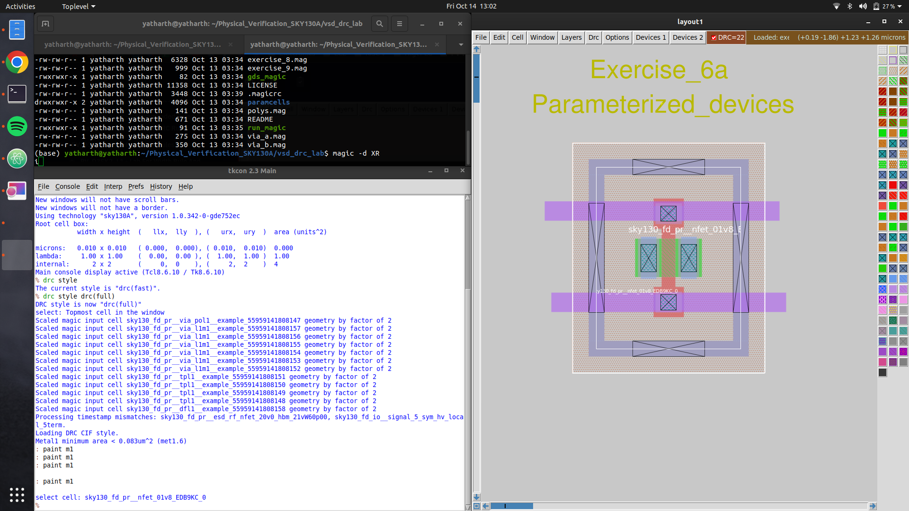
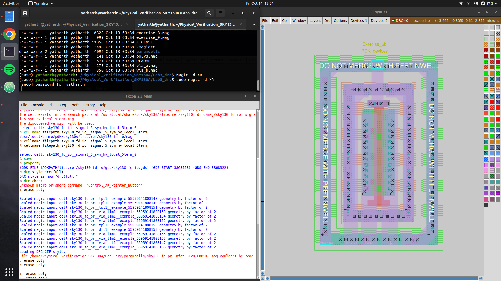
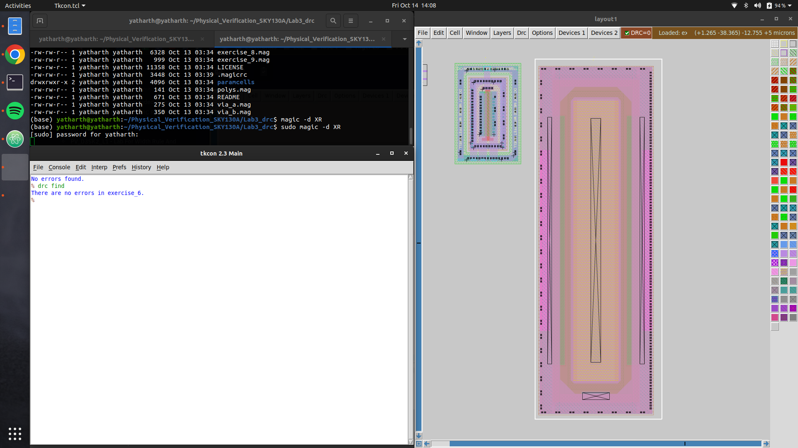
#### Angle errors
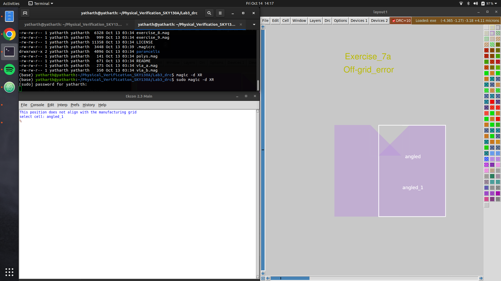
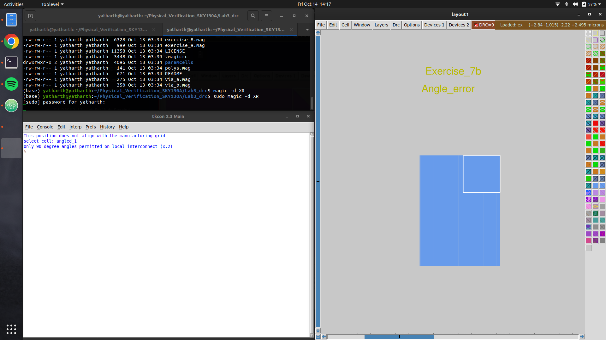
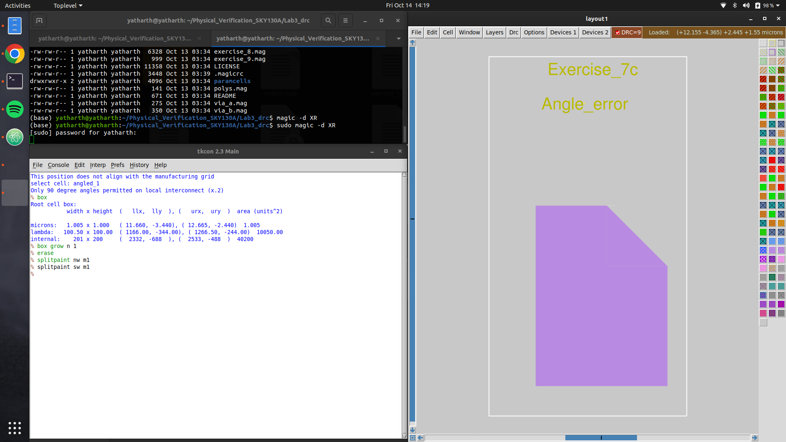
#### Overlap Errors
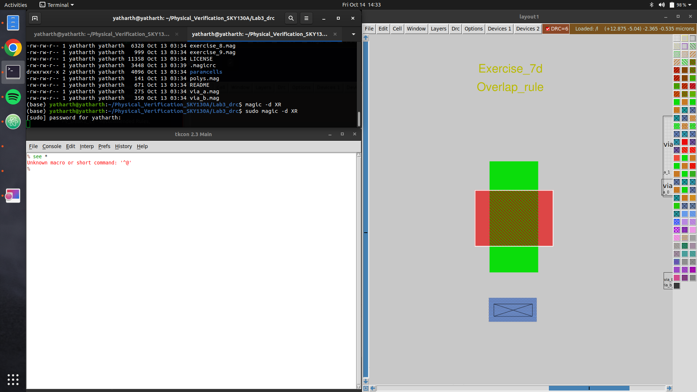
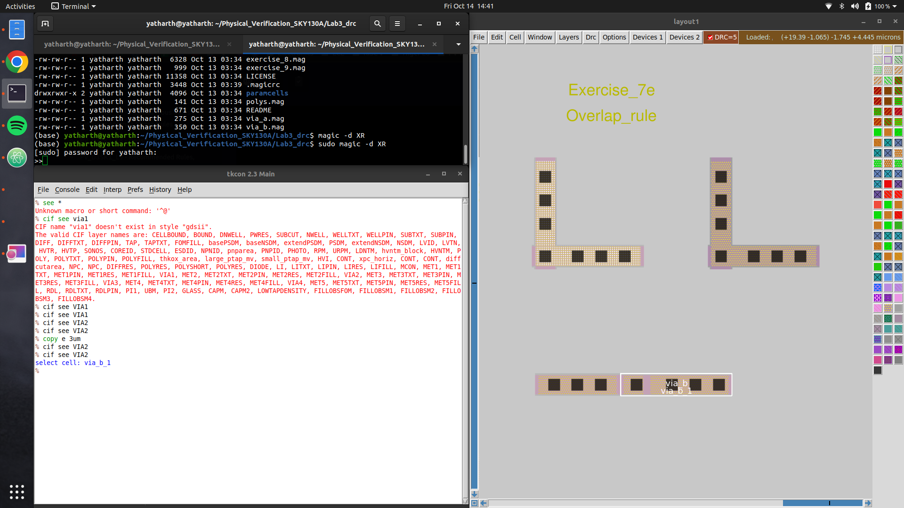

## Chapter 4 - LVS

## Additional Content - OpenLANE Design Flow

OpenLANE is an automated RTL to GDSII flow based on several components including OpenROAD, Yosys, Magic, Netgen, Fault, OpenPhySyn, CVC, SPEF-Extractor and custom methodology scripts for design exploration and optimization. The flow performs full ASIC implementation steps from RTL all the way down to GDSII.

### Design Flow


1. **Synthesis**
    1. `yosys/abc` - Perform RTL synthesis and technology mapping.
    2. `OpenSTA` - Performs static timing analysis on the resulting netlist to generate timing reports
2. **Floorplaning**
    1. `init_fp` - Defines the core area for the macro as well as the rows (used for placement) and the tracks (used for routing)
    2. `ioplacer` - Places the macro input and output ports
    3. `pdngen` - Generates the power distribution network
    4. `tapcell` - Inserts welltap and decap cells in the floorplan
3. **Placement**
    1. `RePLace` - Performs global placement
    2. `Resizer` - Performs optional optimizations on the design
    3. `OpenDP` - Perfroms detailed placement to legalize the globally placed components
4. **CTS**
    1. `TritonCTS` - Synthesizes the clock distribution network (the clock tree)
5. **Routing**
    1. `FastRoute` - Performs global routing to generate a guide file for the detailed router
    2. `TritonRoute` - Performs detailed routing
    3. `OpenRCX` - Performs SPEF extraction
6. **Tapeout**
    1. `Magic` - Streams out the final GDSII layout file from the routed def
    2. `KLayout` - Streams out the final GDSII layout file from the routed def as a back-up
7. **Signoff**
    1. `Magic` - Performs DRC Checks & Antenna Checks
    2. `KLayout` - Performs DRC Checks
    3. `Netgen` - Performs LVS Checks
    4. `CVC` - Performs Circuit Validity Checks

All the information about the project can be found in the openlANE documentation:
[https://openlane.readthedocs.io/en/latest/index.html](https://openlane.readthedocs.io/en/latest/index.html)

### config.tcl

this file is nessecary for running the openLANE flow and its documentation can be found at:
[https://openlane.readthedocs.io/en/latest/reference/configuration.html](https://openlane.readthedocs.io/en/latest/reference/configuration.html)

### Example - openLANE without interactive run
run the following in the openLANE deirectory
```
export PDK_ROOT=/usr/local/share/pdk
make mount
./flow.tcl -design spm -tag run1
```

This runs the entire openLANE flow and generates the required GDSII and .mag files which can be viewed in magic

### Example - openLANE with interactive run

The interactive flow allows to run each step of the design flow. It can be launched using
```
export PDK_ROOT=/usr/local/share/pdk
make mount
./flow.tcl -interactive
```
Start the Design flow  and synthesis with the following
```
package require openlane
prep -design spm -tag run1
run_synthesis
```
Run the Floorplaning using
```
run_floorplan
```
Run the placement using
```
run_placement
```
Run the clock tree generation and STA using
```
run_cts
```
The clock tree can be optimized using
```
run_resizer_timing
```
Run the routing using
```
run_routing
```
After all the changes that have taken place a new verilog file can be obtained using
```
write_powered_verilog
set_netlist $::env(lvs_result_file_tag).powered.v
```
Generate GDSII file using
```
run_magic
```
An alternate GDSII file is generated using klayout for XOR verification
```
run_klayout
```
Run the XOR test using
```
run_klayout_gds_xor
```
Export spice netlist using
```
run_magic_spice_export
```
Run LVS on exported spice netlist and verilog file
```
run_lvs
```
DRC checks
```
run_magic_drc
```
Antenna Checks
```
run_antenna_check
```
LEF checks
DRC_checks
```
run_lef_cvc
```
Final summary report can be generated using
DRC_checks
```
generate_final_summary_report
```
### Example - Technique to prevant DRC errors
- **Local Interconnect rules**  : Avoid routing large traces on the local interconnect
- **Density Planning** : The utilization ratio can be reduced to form more spaced circuits with lesser errors The FP_CORE_UTIL variable in the .config file
- **Dont use cells** : Avoid using cells that are known to cause errors
- **Manual verification** : For designs with lower number of DRC errors, the can be corrected with the methods disscused in chapter 3
