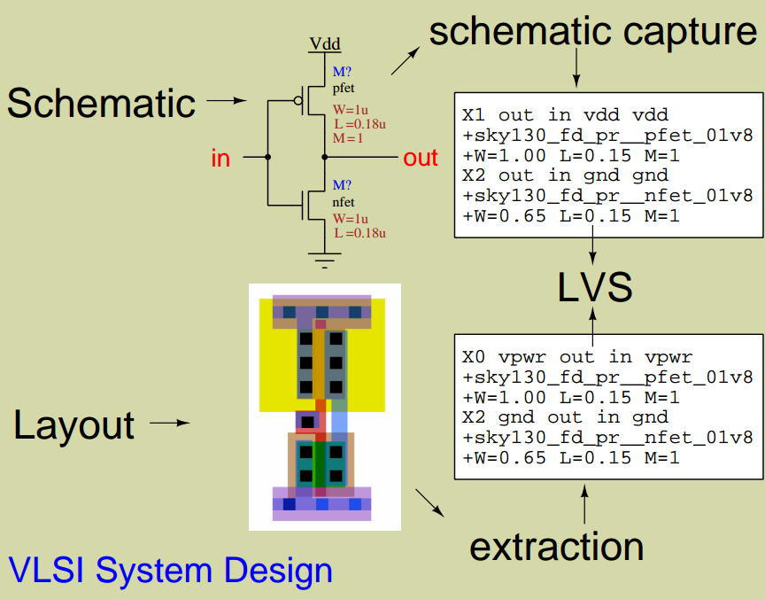

# Physical_Verification_SKY130A

## About the project

## Index

## Chapter 0 - Getting the tools

## Chapter 1 - Understanding the design flow

## Chapter 2 - DRC and LVS

### Design Rule Checking (DRC)
Make sure design layout meets all silicon foundry rules for masks.

###Layout vs. Schematic (LVS)
Make sure design layout matches a simulatable netlist by electrical connectivity and devices.

