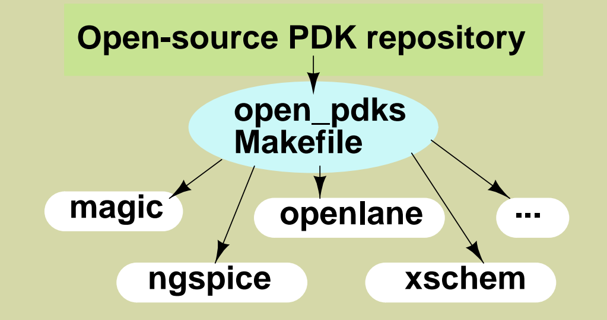

# Physical_Verification_SKY130A

## About the project

## Index

## Chapter 0 - Getting the tools

To adequetly utilize the open source skywater130 pdk and understand the design flow we first require to install all the tools, which are
- open_pdk
- magic
- ngspice
- xschem
- netgen


*Note: open_pdk has to be installed last so it can correctly associate the xschem and magic directories.*

### Magic
Magic is an open source VLSI layout tool.<br />
Install steps
```
$  git clone git://opencircuitdesign.com/magic
$  cd magic
$	 ./configure
$  make
$  sudo make install
```
More info can be found at: [http://opencircuitdesign.com/magic/index.html](http://opencircuitdesign.com/magic/index.html)

### Netgen
Netgen is a tool for comparing netlists, a process known as LVS, which stands for "Layout vs. Schematic" <br /><br />
Install steps:
```
$  git clone git://opencircuitdesign.com/netgen
$  cd netgen
$	./configure
$  make
$  sudo make install
```
More info can be found at: [http://opencircuitdesign.com/netgen/index.html](http://opencircuitdesign.com/netgen/index.html)

### Xschem
Xschem is a schematic capture program <br /><br />
Install steps:
```
$  git clone https://github.com/StefanSchippers/xschem.git xschem_git
$	./configure
$  make
$  sudo make install
```
More info can be found at: [http://repo.hu/projects/xschem/index.html](http://repo.hu/projects/xschem/index.html)

### Ngspice
ngspice is the open source spice simulator for electric and electronic circuits.<br /><br />
Install steps:<br />

After downloading the tar ball from [https://sourceforge.net/projects/ngspice/files/](https://sourceforge.net/projects/ngspice/files/) to a local directory unpack it using:
```
 $ tar -zxvf ngspice-37.tar.gz
 $ cd ngspice-37
 $ mkdir release
 $ cd release
 $ ../configure  --with-x --with-readline=yes --disable-debug
 $ make
 $ sudo make install
```
More info can be found at: [https://ngspice.sourceforge.io/index.html](https://ngspice.sourceforge.io/index.html)

Please note that to view the simulation graphs of ngspice, xterm is required and can be installed using
```
$ sudo apt-get update
$ sudo apt-get install xterm
```

### open_pdk

Open_PDKs is distributed with files that support the Google/SkyWater sky130 open process description [https://github.com/google/skywater-pdk](https://github.com/google/skywater-pdk). Open_PDKs will set up an environment for using the SkyWater sky130 process with open-source EDA tools and tool flows such as magic, qflow, openlane, netgen, klayout, etc.<br /><br />
Install steps:
```
$  git clone git://opencircuitdesign.com/open_pdks
$  open_pdks
$	./configure --enable-sky130-pdk
$  make
$  sudo make install
```

Now that we have all the required tools installed lets get started with understanding the design flow!
## Chapter 1 - Understanding the design flow

### Verifiying the open_pdk installation

### Creating inverter schematic using xschem

### Creating and simulating testbench Schematic

### Creating inverter layout in Magic and exporting its netlist

### Performing LVS checks on testbench and layout netlists

## Chapter 2 - DRC and LVS

### Design Rule Checking (DRC)
Make sure design layout meets all silicon foundry rules for masks.

### Layout vs. Schematic (LVS)
Make sure design layout matches a simulatable netlist by electrical connectivity and devices.


### GDSII file format

### Reading GDS files

```
% cif list istyle
% gds read /usr/local/share/pdk/sky130A/libs.ref/sky130_fd_sc_hd/gds/sky130_fd_sc_hd.gds
```

```
% cif istyle sky130(vendor)
% gds read /usr/local/share/pdk/sky130A/libs.ref/sky130_fd_sc_hd/gds/sky130_fd_sc_hd.gds
```

```
% gds noduplicates true
```


### Matching ports to spice netlists

```
% port first
% port 1 name
% port 1 class
% port 1 use
```
```
% lef read /usr/local/share/pdk/sky130A/libs.ref/sky130_fd_sc_hd/lef/sky130_fd_sc_hd.lef
```
```
% readspice /usr/local/share/pdk/sky130A/libs.ref/sky130_fd_sc_hd/spice/sky130_fd_sc_hd.spice
```

### Abstract views

```
% lef read /usr/local/share/pdk/sky130A/libs.ref/sky130_fd_sc_hd/lef/sky130_fd_sc_hd.lef
% readspice /usr/local/share/pdk/sky130A/libs.ref/sky130_fd_sc_hd/spice/sky130_fd_sc_hd.spice
load test
get cell sky130_fd_sc_hd__and2_1
gds write test     
```
```
%gds read test
%save test
```
```
%load test
%gds write test
```
%property

```
% cellname writeable sky130_fd_sc_hd__and2_1 true
```
edit cell
```
% gds write test
```
```
% gds read test
```

% gds readonly true
% gds rescale false
% gds read /usr/local/share/pdk/sky130A/libs.ref/sky130_fd_sc_hd/gds/sky130_fd_sc_hd.gds  
% load sky130_fd_sc_hd__and2_1
% property


### Extraction
```
% extract all
% ext2spice lvs
% ext2spice
```

```
% ext2spice cthresh 0.01
% ext2spice
```
! select cell

```
% ext2sim labels on
% ext2sim

% extresist tolerance 10
% extresist

% ext2spice lvs
% ext2spice cthresh 0.01
% ext2spice extresist on
% ext2spice
```

### DRC

/usr/local/share/pdk/sky130A/libs.tech/magic/run_standard_drc.py /usr/local/share/pdk/sky130A/libs.ref/sky130_fd_sc_hd/mag/sky130_fd_sc_hd__and2_1.mag

% drc style drc(full)
% drc check
% drc why
% drc find

% getcell sky130_fd_sc_hd__tapvpwrvgnd_1

### LVS

cp /usr/local/share/pdk/sky130A/libs.tech/netgen/sky130A_setup.tcl ./setup.tcl

netgen -batch lvs "../mag/sky130_fd_sc_hd__and2_1.spice sky130_fd_sc_hd__and2_1" "/usr/local/share/pdk/sky130A/libs.ref/sky130_fd_sc_hd/spice/sky130_fd_sc_hd.spice sky130_fd_sc_hd__and2_1"

### XOR

% flatten -nolabels xor_test
% xor -nolables xor_test
% load xor_test
